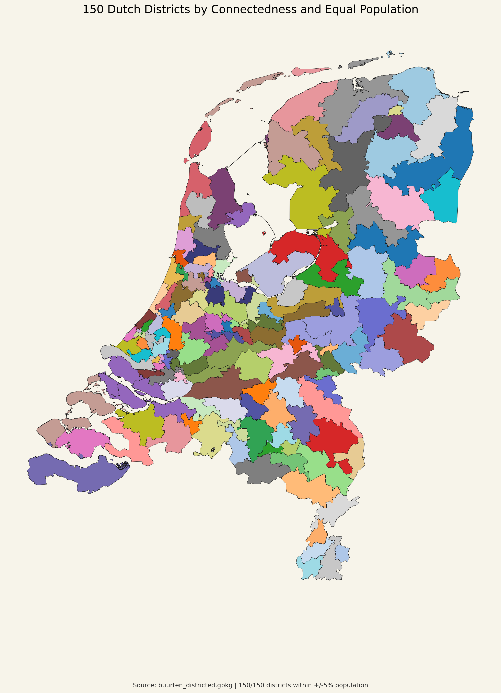

# Dutch Districts Overview Map

## What is shown

This is the general overview map of the final 150-district plan for the Netherlands.

- each polygon is one district;
- colors are categorical and only help separate neighboring districts visually;
- this map is meant as a clean high-level view of the final partition.

## How to read it

This image is useful when you want to inspect:

- the overall shape of the district plan;
- where district boundaries run;
- how compact or stretched different districts look on the map.

## Important note

Unlike the thematic maps, the colors here do not encode a metric such as population or connectedness. They are only visual labels.
