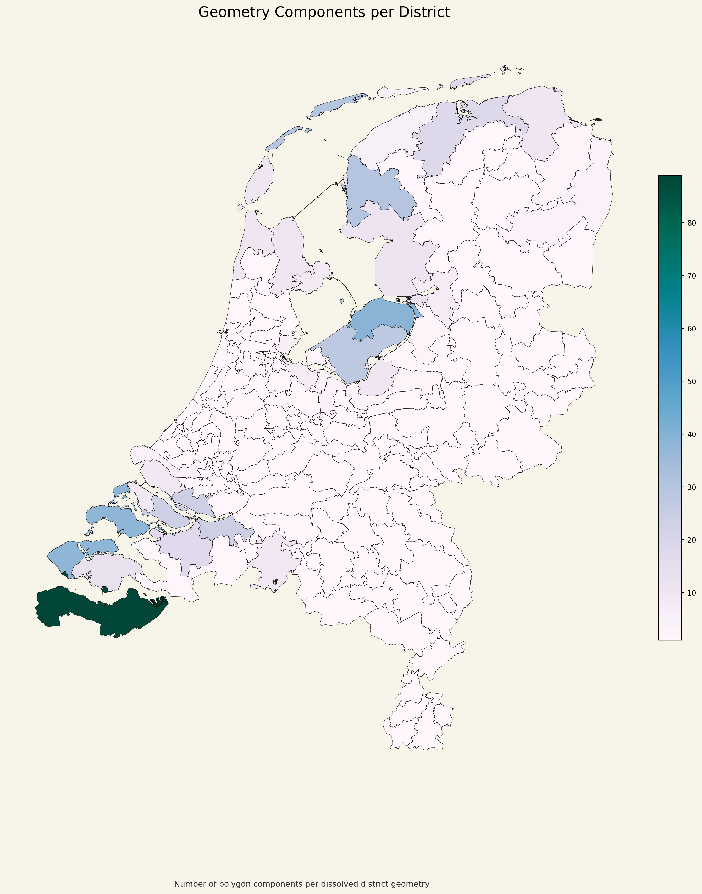

# District Components Map

## Что изображено

На этой карте показано количество геометрических компонент в каждом округе после объединения полигонов.

- одна компонента означает цельную геометрию;
- несколько компонент означают `MultiPolygon`;
- цвет показывает число отдельных частей в геометрии округа.

## Как это читать

Эта карта помогает отличать:

- графовую связность в терминах соседства;
- геометрическую цельность итогового polygon/multipolygon представления.

## Что важно в данном проекте

В итоговой валидации по графу все округа связны, но эта карта нужна как дополнительная геометрическая диагностика итогового слоя.

Если где-то значение больше `1`, это означает, что геометрия округа состоит из нескольких отдельных полигональных частей.
