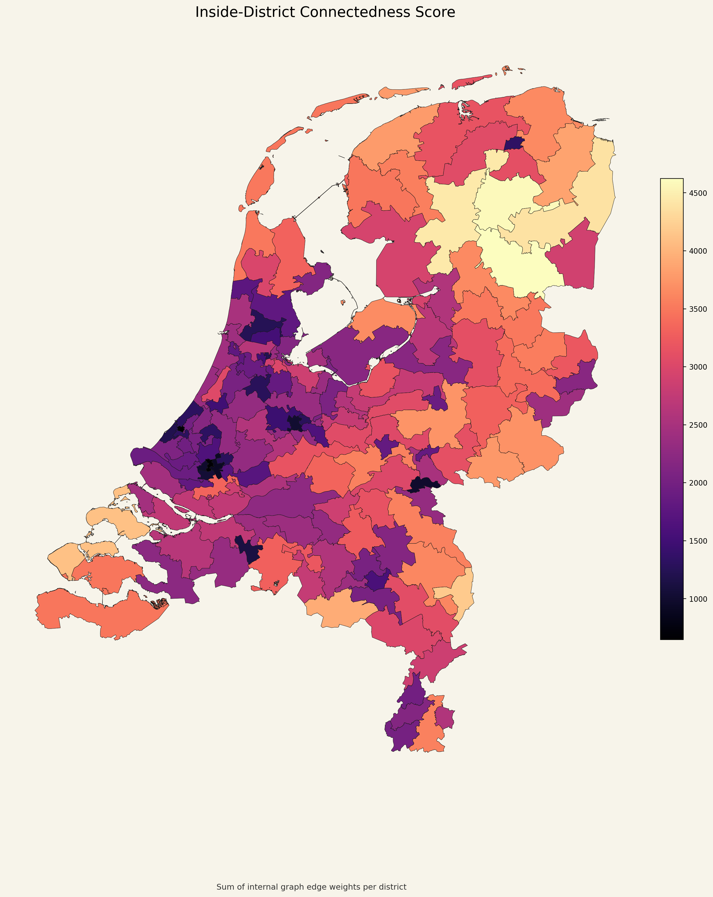

# District Connectedness Map

## Что изображено

На этой карте показан `inside-district connectedness score` для каждого округа.

- для каждого округа суммируются веса рёбер графа, которые остаются внутри его границ;
- цвет показывает величину этой суммы;
- чем выше значение, тем сильнее внутренняя графовая связность округа по используемой в проекте метрике.

## Как это читать

Это не население и не площадь. Это именно метрика качества разбиения с точки зрения выбранного прокси для `community of interest`.

- более высокий цветовой уровень означает, что внутри округа больше сильных внутренних связей;
- более низкий уровень означает, что округ в меньшей степени удерживает внутри себя “сильные” связи графа.

## Что важно в данном проекте

Именно эту величину алгоритм пытался максимизировать при условии, что округа остаются связными и почти равными по населению.
