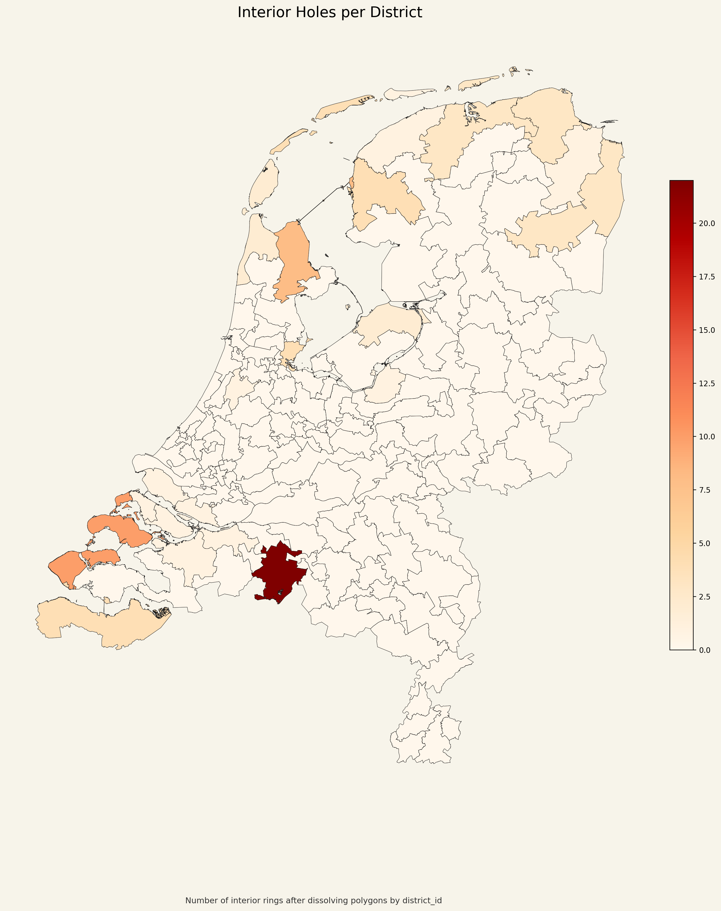

# District Holes Map

## Что изображено

На этой карте показано количество внутренних дыр в геометрии каждого округа после объединения всех его полигонов по `district_id`.

- дыра означает внутреннее кольцо в итоговой геометрии округа;
- цвет показывает число таких внутренних отверстий;
- чем насыщеннее цвет, тем больше внутренних дыр у округа.

## Как это читать

Эта карта не показывает связность графа. Она показывает топологические особенности уже растворённой геометрии округа.

- значение `0` означает, что у округа нет внутренних отверстий;
- положительное значение означает, что после `dissolve` внутри геометрии остались дыры.

## Что важно в данном проекте

Эта карта полезна для проверки более строгой интерпретации условия `no enclaves`.

Наличие дыр не обязательно означает политический или административный анклав, но это сигнал, что округ имеет более сложную геометрию и требует отдельной топологической проверки.
