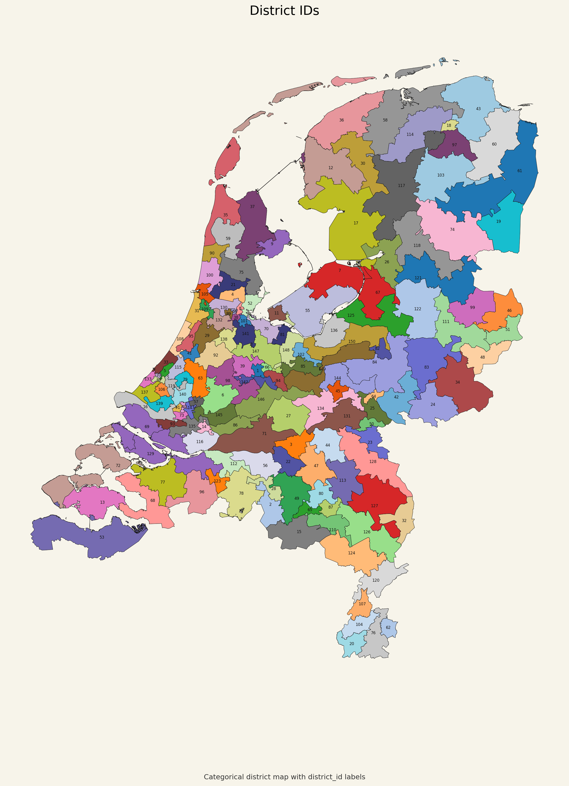

# District ID Labeled Map

## Что изображено

На этой карте показано то же итоговое разбиение на 150 округов, но с подписями `district_id`.

- каждый цвет здесь категориальный и не несёт количественного смысла;
- подпись внутри полигона показывает идентификатор округа;
- карта нужна для визуальной навигации по конкретным округам.

## Как это читать

Эта карта полезна, когда нужно:

- быстро найти нужный округ по номеру;
- сопоставить округ между разными картами;
- обсуждать конкретные случаи без привязки к цветовой шкале.

## Что важно в данном проекте

Это справочная карта. В отличие от остальных карт, здесь цвет не кодирует метрику, а служит только для визуального разделения соседних округов.
