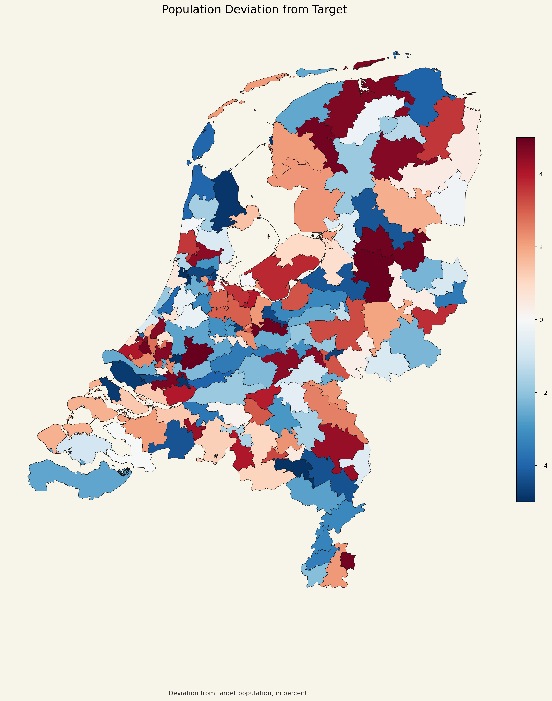

# District Population Deviation Map

## Что изображено

На этой карте показано отклонение населения каждого округа от целевого значения.

- целевое население округа в проекте: `119,619`;
- цвет показывает отклонение в процентах;
- одна сторона шкалы означает округа ниже цели, другая сторона означает округа выше цели.

## Как это читать

Эта карта полезнее обычной карты населения, потому что показывает не абсолютное значение, а именно ошибку относительно целевого баланса.

- цвет около нейтрального означает округ, близкий к целевому населению;
- более насыщённый цвет означает большее отклонение;
- поскольку итоговое решение валидно, отклонения должны оставаться внутри диапазона `±5%`.

## Что важно в данном проекте

Эта карта напрямую показывает, насколько хорошо выполнено главное ограничение по равенству населения.
