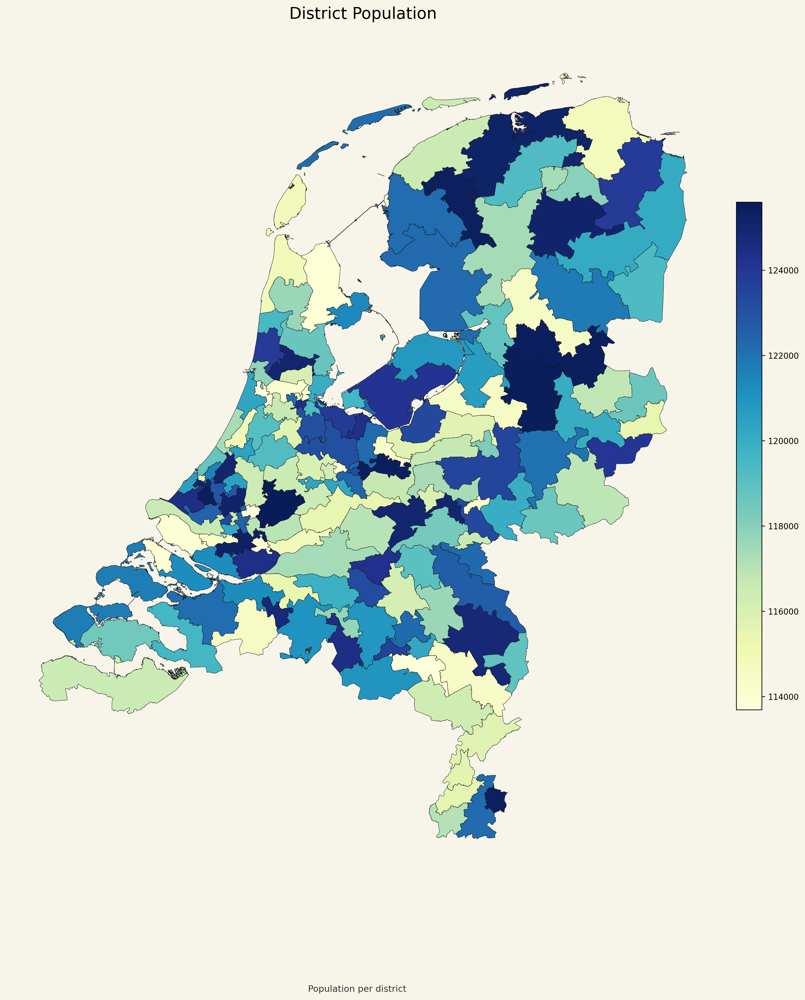

# District Population Map

## Что изображено

На этой карте показано население каждого из 150 округов.

- каждый полигон соответствует одному округу;
- цвет показывает суммарное население округа;
- чем интенсивнее цвет, тем больше население округа относительно остальных.

## Как это читать

Эта карта нужна для быстрой визуальной проверки популяционного баланса между округами.

- если цвета близки друг к другу, распределение населения визуально ровное;
- если какой-то округ сильно выделяется, это означает, что его население заметно отличается от других.

## Что важно в данном проекте

Итоговое разбиение было построено с ограничением `±5%` от целевого населения округа, поэтому различия на этой карте должны быть умеренными, а не экстремальными.
